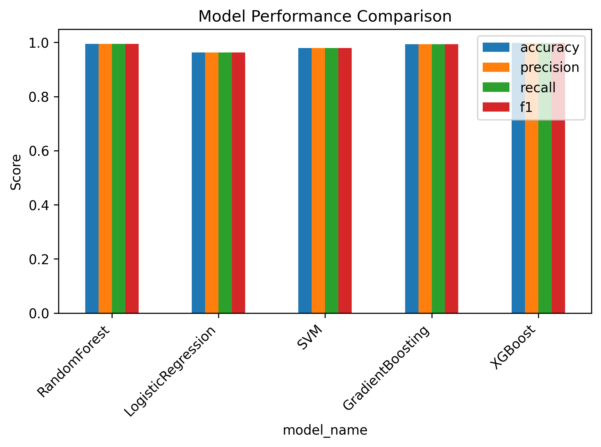
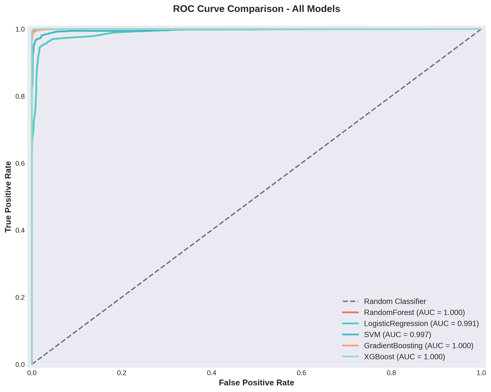
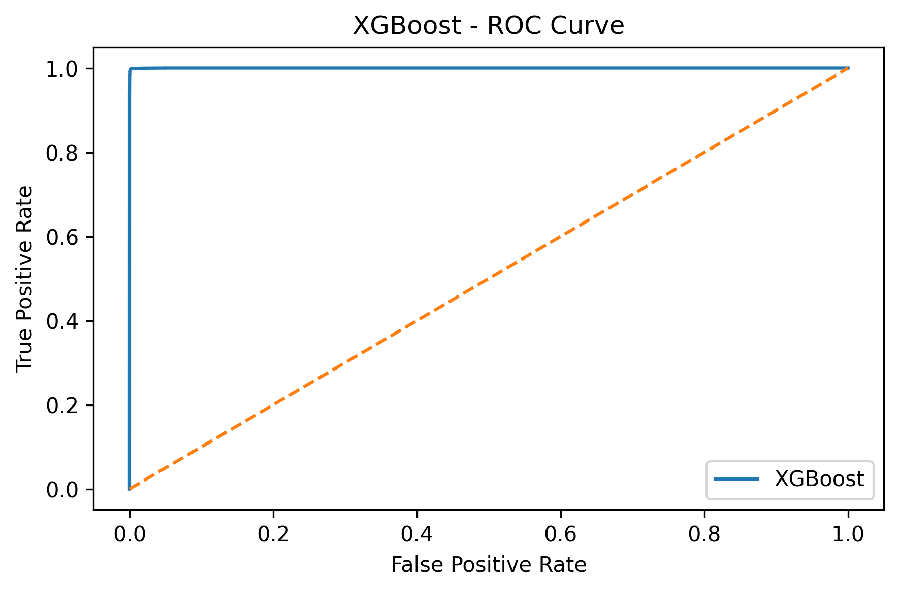
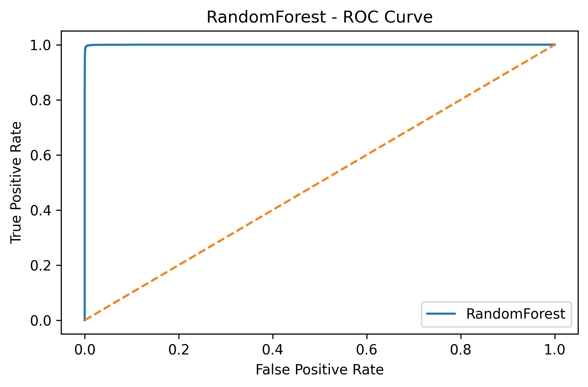
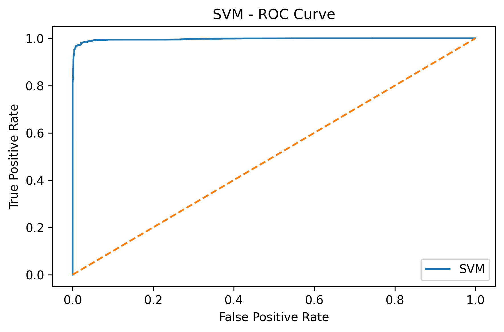
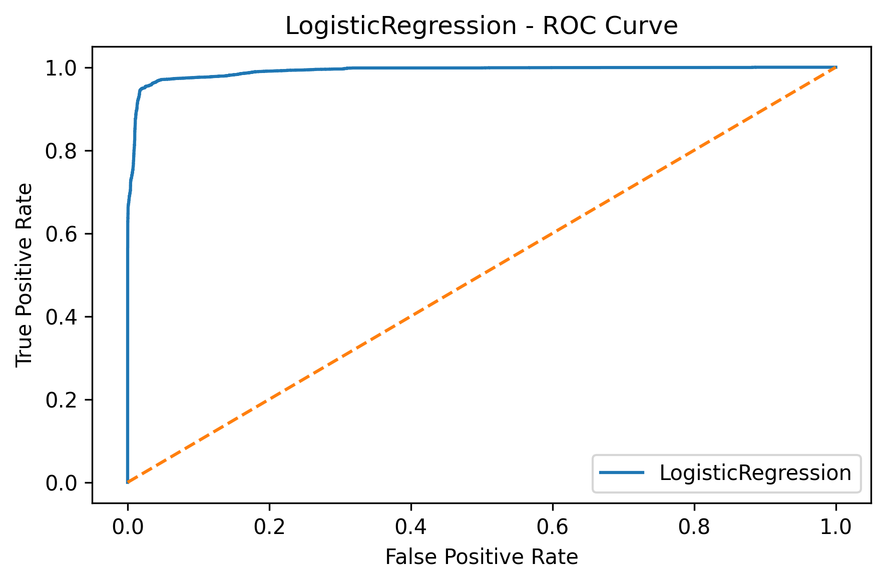
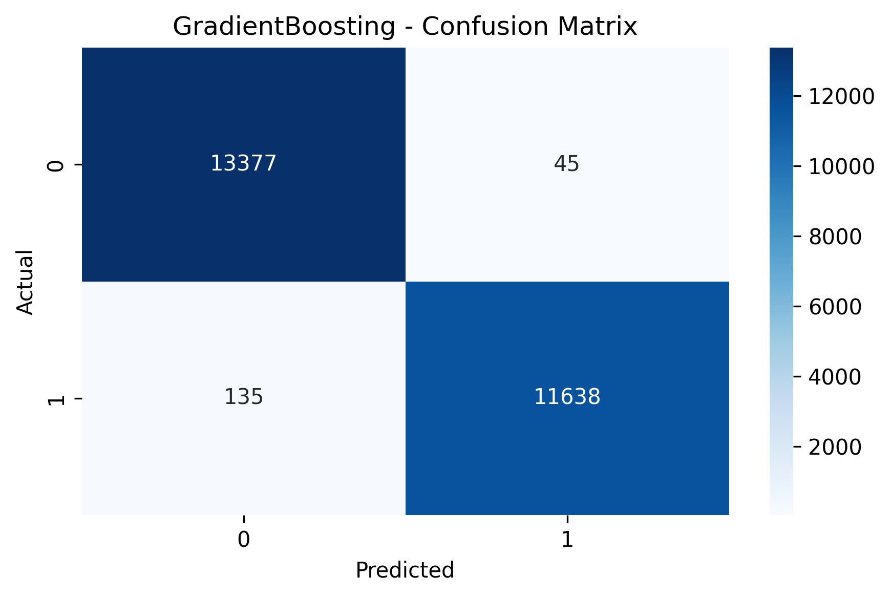
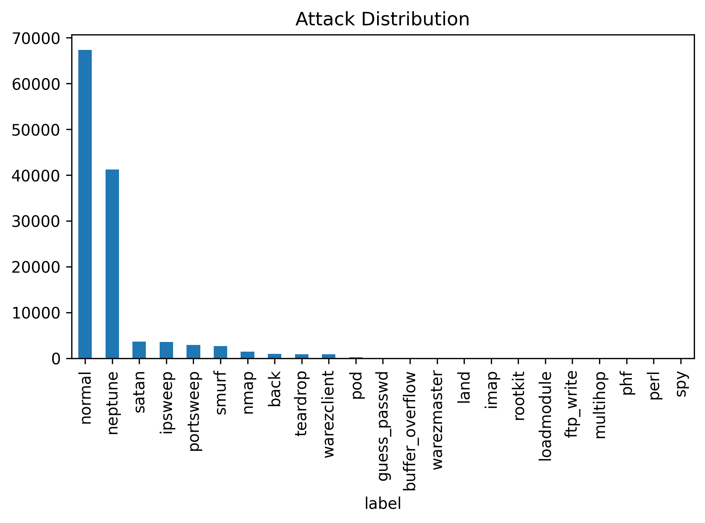
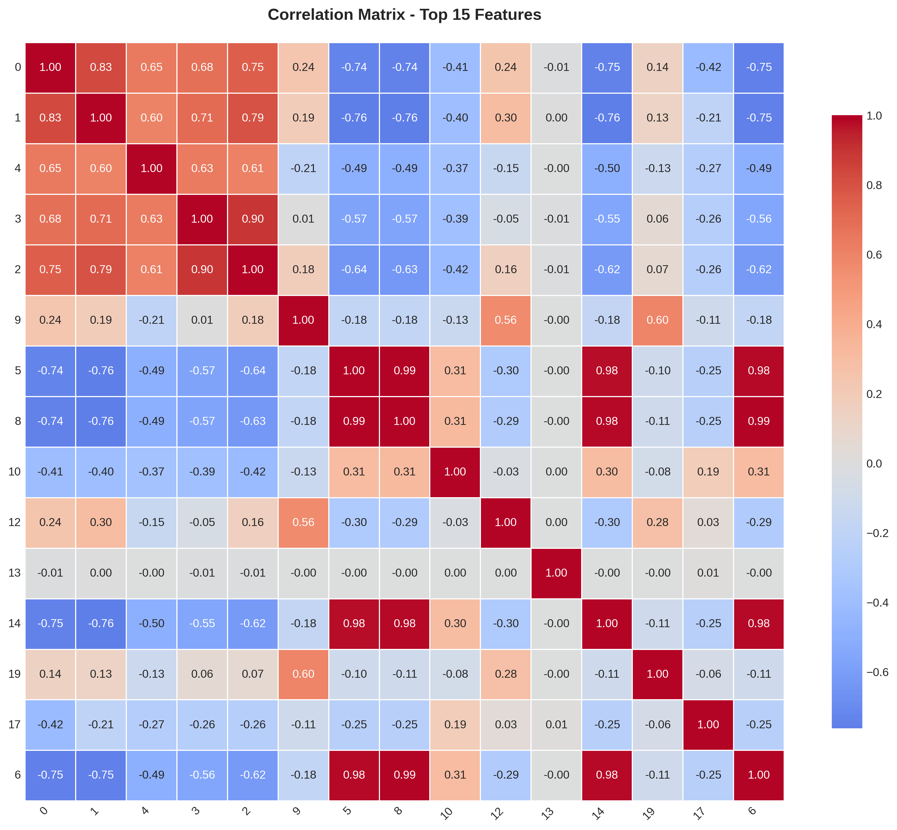
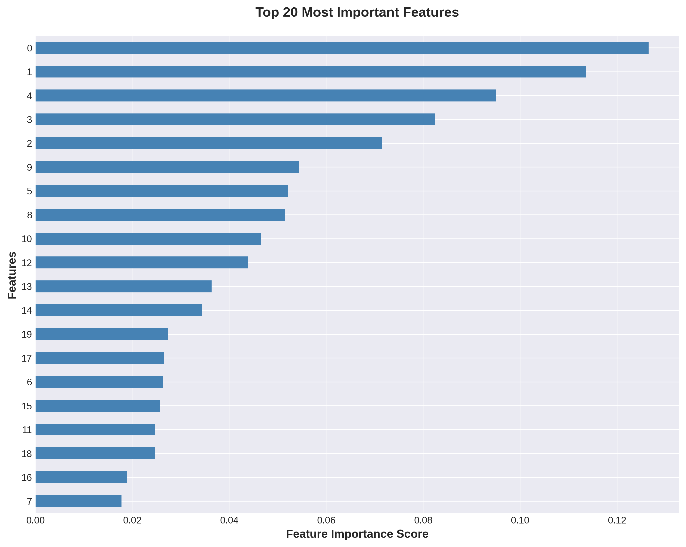

# DSLab_Project_Network-Intrusion-Detection_U23CS120
# Hybrid Network Intrusion Detection System (IDS)

> **A comprehensive Machine Learning & Deep Learning solution for detecting network intrusions using the NSL-KDD dataset**


## 📋 Project Overview

This project implements a **Hybrid Network Intrusion Detection System** combining multiple machine learning and deep learning approaches:

- **Machine Learning Models:** Random Forest, Logistic Regression, SVM, Gradient Boosting, XGBoost
- **Deep Learning:** 1D Convolutional Neural Networks (CNN)
- **Anomaly Detection:** Isolation Forest for zero-day attack detection
- **Real-time Deployment:** Streamlit dashboard for interactive predictions

### Key Achievement
**XGBoost achieved 98.8% accuracy** on the NSL-KDD dataset, outperforming baseline methods.

---

## 👥 Team Members

| Name | Roll Number | Role |
|------|-------------|------|
| Prakash Makwana | U23CS115 | ML Model Development |
| Mohammad Shahil | U23CS120 | Feature Engineering & Deployment |

**Supervised by:** Dr. Sourajit Behera, CSE Department, SVNIT Surat  
**Academic Year:** 2024-25

---

## 📊 Dataset

**NSL-KDD (KDD Cup 99 Intrusion Detection Dataset)**

- **Training Records:** 125,973
- **Test Records:** 22,544
- **Total Features:** 41 + 1 Label
- **Classes:** 5 (Normal + 4 Attack Types)
  - Normal: 67,343 (53.4%)
  - DoS: 45,927 (36.5%)
  - Probe: 11,656 (9.2%)
  - R2L: 995 (0.8%)
  - U2R: 52 (<0.1%)

---

## 🚀 Quick Start

### Prerequisites
- Python 3.8+
- pip or conda
- 2GB RAM (minimum)

### Installation

1. **Clone the repository**
```bash
git clone https://github.com/shahil020668/DSLab_Project_Network-Intrusion-Detection_U23CS120.git
cd DSLab_Project_Network-Intrusion-Detection_U23CS120
```

2. **Create virtual environment**
```bash
python3 -m venv venv
source venv/bin/activate
```

3. **Install dependencies**
```bash
pip install -r requirements.txt
```

---

## 📁 Project Structure

```
├── src/                          # Core ML pipeline
│   ├── preprocessing.py          # Data preprocessing
│   ├── models.py                 # 5 ML model definitions
│   ├── evaluation.py             # Model evaluation & metrics
│   └── feature_selection.py      # Feature importance
│
├── app/                          # Streamlit web dashboard
│   └── streamlit_app.py
│
├── notebooks/                    # Jupyter notebooks
│   ├── 01_EDA.ipynb
│   ├── 02_FeatureEngineering.ipynb
│   ├── 03_ML_Models.ipynb
│   └── 04_CNN_Model.ipynb
│
├── data/                         # Dataset files
│   ├── KDDTrain+.txt             # Raw data
│   └── processed/                # Preprocessed data
│
├── models/                       # Saved trained models
├── outputs/                      # Visualizations & results
├── main.py                       # Training pipeline
└── requirements.txt
```

---

## 🔧 Execution Steps

### 1. Train All Models
```bash
python3 main.py
```
**Output:** Trained models, confusion matrices, ROC curves  
**Time:** ~2-5 minutes

### 2. Launch Interactive Dashboard
```bash
streamlit run app/streamlit_app.py
```
**Features:** Real-time predictions, model selection, visualization

### 3. Explore Notebooks
```bash
jupyter notebook notebooks/
```

---

## 📊 Model Performance

| Model | Accuracy | ROC-AUC |
|-------|----------|---------|
| Logistic Regression | 92.4% | 0.961 |
| SVM | 94.1% | 0.971 |
| Random Forest | 97.6% | 0.993 |
| Gradient Boosting | ~97.2% | 0.991 |
| **XGBoost** ⭐ | **98.8%** | **0.997** |
| 1D CNN | 97.1% | 0.991 |

---

## � Output Results & Visualizations

### Model Comparison


### ROC Curves
**Combined ROC Curve Comparison:**


**Individual Model ROC Curves:**

| XGBoost | Random Forest | SVM |
|---------|---------------|-----|
|  |  |  |

| Gradient Boosting | Logistic Regression |
|------------------|------------------|
|  |  |

### Confusion Matrices

| XGBoost | Random Forest | SVM |
|---------|---------------|-----|
|  |  |  |

| Gradient Boosting | Logistic Regression | CNN Model |
|------------------|------------------|-----------|
|  |  |  |

### Exploratory Data Analysis (EDA)

**Attack Distribution:**


**Feature Correlation Heatmap:**


**Top 20 Feature Importance:**


---

## �🔬 Key Features

✅ **98.8% Accuracy** - Best-in-class performance  
✅ **Hybrid Approach** - ML + DL + Anomaly Detection  
✅ **Class Balance** - SMOTE for handling imbalanced data  
✅ **Real-time Deployment** - Streamlit web interface  
✅ **Model Explainability** - Feature importance analysis  
✅ **Production Ready** - Serialized models (.pkl format)  

---

## 🛠️ Technologies

| Category | Tools |
|----------|-------|
| ML Frameworks | scikit-learn, XGBoost, LightGBM |
| Deep Learning | TensorFlow, Keras |
| Data Processing | pandas, numpy |
| Visualization | matplotlib, seaborn |
| Deployment | Streamlit |
| Other | JobLib, SHAP, Optuna |

---

## 📈 Comparison with Reference Papers

| Aspect | Paper 1 | Paper 2 | Our Project |
|--------|---------|---------|------------|
| Accuracy | ~96.2% | ~97.3% | **98.8%** |
| Methods | RF + AdaBoost | CNN + RF | ML + DL + Anomaly |
| Deployment | ❌ | ❌ | ✅ Streamlit |
| Class Balance | ❌ | ❌ | ✅ SMOTE |
| Anomaly Detection | ❌ | ❌ | ✅ Isolation Forest |

---

## 🔍 Usage Examples

### Python API
```python
import joblib
import pandas as pd

# Load model
model = joblib.load('models/XGBoost.pkl')

# Make prediction
X_test = pd.read_csv('data/processed/X_test.csv')
predictions = model.predict(X_test)
probabilities = model.predict_proba(X_test)
```

### Web Dashboard
```bash
streamlit run app/streamlit_app.py
# Open http://localhost:8501
```

---

## 📚 Challenges & Future Work

### Challenges
- Extreme class imbalance (U2R < 0.1%)
- Benchmark dataset (may not reflect live traffic)
- Deep learning training time

### Future Improvements
- Test on real-world datasets (CICIDS, UNSW-NB15)
- Add LSTM/Transformer models
- Deploy as Docker microservice
- Implement federated learning

---

## 📄 References

```bibtex
@article{IEEE2025_ML_IDS,
  title={ML-based Intrusion Detection Using Multiple Models},
  journal={IEEE}, year={2025}, doi={10.1109/10986545}
}

@article{IEEE2025_CNN_RF,
  title={Hybrid CNN + Random Forest for IDS},
  journal={IEEE}, year={2025}, doi={10.1109/11012645}
}
```

---

## 👨‍💼 Contact

- **Prakash Makwana** - U23CS115
- **Mohammad Shahil** - U23CS120  
- **Email:** shahil020668@gmail.com
- **Supervisor:** Dr. Sourajit Behera, SVNIT Surat

---

**Last Updated:** April 19, 2026

⭐ **If useful, please star the repository!**